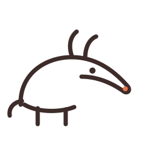

<p align="center">
  
</p>

<h1 align="center">ardvark</h1>

<p align="center">
  Crawls the web for <a href="https://agenticresourcediscovery.org">ARD</a> <code>ai-catalog.json</code> documents,
  verifies them against the spec, and indexes every discovered agentic resource.
</p>

---

Publishers advertise their AI agents, MCP servers, and skills in an `ai-catalog.json` at `/.well-known/`. ardvark finds those catalogs, checks them against the ARD specification, and records everything — hosts probed, catalogs found, entries, verification results — in SQLite/MySQL/Postgres plus a JSONL event log. The result is a clean, queryable dataset of the agentic resources the web is publishing — use it to track ARD adoption, feed a registry, or build whatever you want on top.

## Features

- **Domain harvesting** — crawl from seed URLs or URL lists, follow anchors to collect hosts, then probe each host once
- **Every ARD discovery mechanism** — `/.well-known/ai-catalog.json`, `Agentmap:` directives in robots.txt, and `<link rel="ai-catalog">` tags
- **Full catalog resolution** — recurses into nested catalogs, fetches referenced artifact documents (agent cards, MCP server cards), and harvests discovered registries via `POST /search`, including registry referrals
- **Spec verification** — official JSON Schema plus seven semantic checks (URN grammar, value-or-reference exclusivity, query counts, …), each recorded pass/fail with a message
- **CT-log seeding** — bootstrap the frontier with fresh domains from Certificate Transparency logs (`ardvark seed ct`)
- **Swappable storage** — SQLite by default; MySQL and Postgres via one config key; append-only JSONL event log alongside
- **Resumable runs** — the crawl queue lives in the database; kill a run, start it again, it picks up where it stopped
- **Polite by default** — per-host rate limiting, robots.txt compliance, body-size caps, redirect caps, backoff on transient failures

## Install

```sh
# Homebrew
brew install helgesverre/tap/ardvark

# Go
go install github.com/helgesverre/ardvark/cmd/ardvark@latest
```

Or grab a binary from [releases](https://github.com/helgesverre/ardvark/releases).

## Quickstart

Crawl a site and everything it links to, probing each discovered host for ARD catalogs:

```sh
ardvark crawl https://example.com
```

Or skip crawling and probe hosts directly:

```sh
ardvark probe example.com huggingface.co
```

Seed the queue with 1000 freshly-certified domains from Certificate Transparency logs, then work through them:

```sh
ardvark seed ct --count 1000
ardvark crawl
```

Results land in `ardvark.db` (SQLite) and `ardvark.jsonl`. See what you caught:

```sh
ardvark stats
ardvark export --format jsonl --out resources.jsonl
```

## Commands

| Command | What it does |
|---------|--------------|
| `ardvark crawl [url\|domain]... [--list file] [--force]` | Seed the frontier and run the crawler until the queue is empty. Resumes pending work from earlier runs. |
| `ardvark probe <host>...` | Probe specific hosts for ARD documents, no crawling. |
| `ardvark seed ct [--count N] [--log URL]` | Pull the latest N entries from a Certificate Transparency log (default: Let's Encrypt Oak), extract domains, enqueue probes. |
| `ardvark verify <path\|url>` | Verify one catalog — local file or remote URL — and print the check report. Exits 1 if invalid. `--stored` re-verifies everything in the database. |
| `ardvark export [--format jsonl\|csv] [--out file]` | Dump discovered resources with their verification status. |
| `ardvark stats` | Summarize the dataset: hosts probed, catalogs by verdict, entries by type. |
| `ardvark migrate` | Create/update the database schema. |

## Configuration

ardvark runs with sensible defaults and no config file. To change anything, drop an `ardvark.json` in the working directory (or pass `--config path`). The file is schema-validated — a typo'd key or bad value gets a precise error, not silent misbehavior.

```json
{
  "storage": { "driver": "sqlite", "dsn": "ardvark.db" },
  "log":     { "file": "ardvark.jsonl", "level": "info" },
  "crawler": {
    "concurrency": 8,
    "maxDepth": 2,
    "maxPagesPerDomain": 50,
    "perHostRequestsPerSecond": 1,
    "requestTimeoutSeconds": 15,
    "maxBodyBytes": 5242880,
    "userAgent": "ardvark/0.1 (+https://github.com/helgesverre/ardvark)",
    "respectRobotsTxt": true,
    "refreshAfterHours": 168
  },
  "ard":      { "maxCatalogDepth": 3, "fetchArtifacts": true },
  "registry": { "harvest": true, "maxReferralDepth": 2, "pageLimit": 20 },
  "ctSeed":   { "logUrl": "https://oak.ct.letsencrypt.org/2026h2/", "entryCount": 1000 }
}
```

| Key | Default | Meaning |
|-----|---------|---------|
| `storage.driver` | `sqlite` | `sqlite`, `mysql`, or `postgres` |
| `storage.dsn` | `ardvark.db` | File path (sqlite) or DSN (mysql/postgres) |
| `log.file` | `ardvark.jsonl` | JSONL event log path |
| `crawler.concurrency` | `8` | Parallel workers |
| `crawler.maxDepth` | `2` | Anchor-following depth from seeds |
| `crawler.maxPagesPerDomain` | `50` | Page budget per domain |
| `crawler.perHostRequestsPerSecond` | `1` | Politeness rate limit |
| `crawler.refreshAfterHours` | `168` | Skip hosts probed within this window |
| `ard.maxCatalogDepth` | `3` | Nested-catalog recursion bound |
| `registry.maxReferralDepth` | `2` | Registry referral-following bound |

## What gets stored

Every raw document is kept verbatim alongside the extracted data, so you can re-process without re-crawling:

- **domains / probes** — every host probed, by which mechanism, with full probe history
- **catalogs / catalog_entries** — parsed catalogs with URN segments split out for filtering; registry-harvested entries live in the same table with provenance
- **artifacts** — the fetched agent cards and MCP server cards entries point at
- **verification_checks** — one row per check per catalog: a machine-readable spec report card

Invalid catalogs are stored too, flagged `invalid` — "found but broken" is useful data.

## Verification

A catalog's verdict is `valid`, `valid_with_warnings`, or `invalid`, rolled up from:

1. JSON Schema validation against the official ARD schema (Draft 2020-12)
2. Semantic checks the schema can't express — errors: `specVersion == "1.0"`, exactly one of `url`/`data` per entry, URN grammar (`urn:air:<publisher>:<namespace>:<name>`), unique identifiers; warnings: URN publisher matching the serving domain, 2–5 representative queries, recognized media types

Run it standalone against anything:

```sh
ardvark verify ./my-catalog.json
ardvark verify https://example.com/.well-known/ai-catalog.json
```

## Development

```sh
just            # list recipes
just build      # build to ./bin/ardvark
just check      # vet + fmt check + tests
just snapshot   # local goreleaser dry-run
```

## License

MIT
